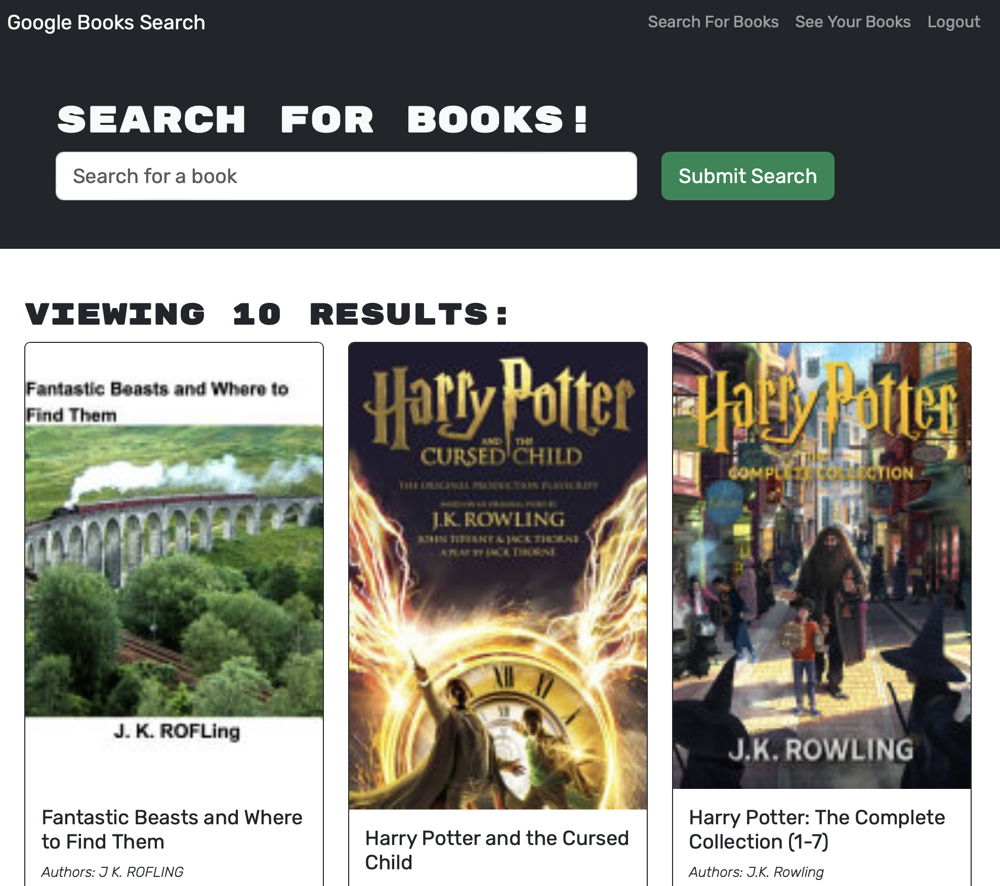

# My Book Engine


## Links

[Visit the deployed site!](https://shielded-forest-03577.herokuapp.com)

## Table of Contents

* [Description](#description)
* [Installation](#installation)
* [Code Example](#code-example)
* [Application Examples](#application-examples)
* [Usage](#usage)
* [License](#license)
* [Questions](#questions)


## Description
The My book Engine is minimalistic book search application that allows users to search for book titles and allows them to save it to their favorites. In order to save a book though, the use must be signed in or create an account to do so within the application. Afterwards the user should be able to remove books from their favorites list if they choose to do so.

## Installation
No installation is needed as this application is deployed to a live site. Simply visit the deployed link above

## Code Example
Below is an example of the defined typeDefs that allow this app to save users books
```JS
const typeDefs = gql`

type Books {
    authors: [String]
    description: String!
    bookId: ID!
    image: String
    link: String
    title: String!
}
type User {
  _id: ID!
  username: String!
  email: String
  bookcount: Int
  savedBooks: [Book]
}
```

## Application Examples
Bellow is an example of the application running within the deployed link



---


## Usage


Make sure you have followed the deployed link within the [links](#links) section. After following the deployed link, the user will be greeted with a blank slate. The user can search for books at the initial loading page but they must either login or create an account to be given the option to save a book to their favorites. Afterwards, when a user no longer wants a book within their favorites they can simply remove it from their list simply by deleting the book. The user will be signed out automatically after a period of time, or they may choose to sign out by clicking the logout option at the top of the page.


## License
For additional information on this license please use the provided link


[MIT License](https://choosealicense.com/licenses/mit/)

## Questions
Please refer any questions to my Github

Github: [jonnyboy808](https://github.com/jonnyboy808)


